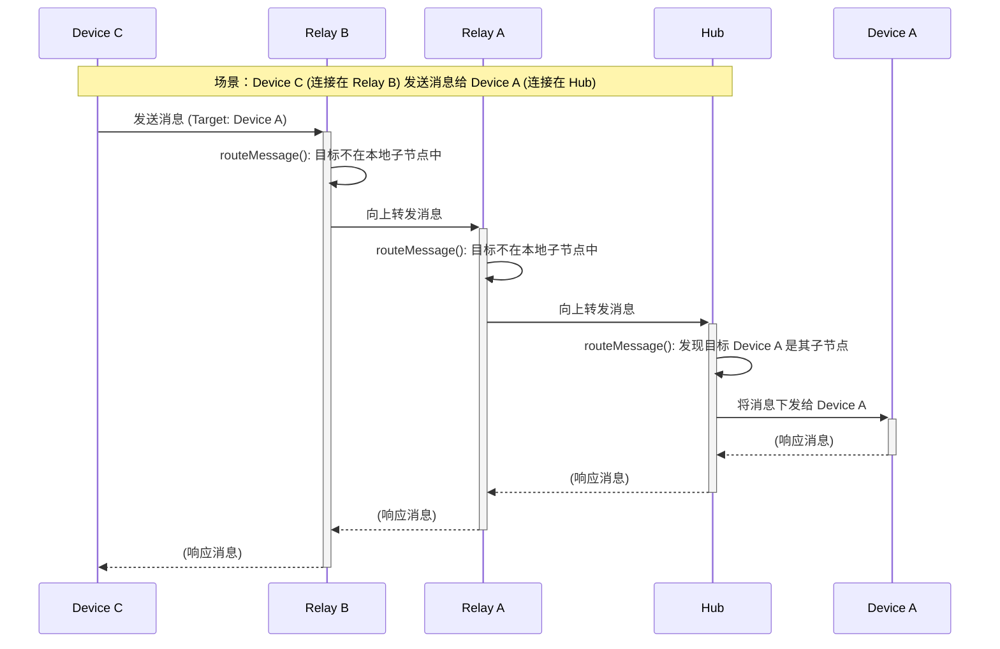

# 系统架构与消息流

本文档旨在通过图表清晰地展示 MyFlowHub 项目的整体架构和核心的消息路由机制。

## 1. 系统架构图 (System Architecture)

此图描绘了系统的主要组件及其相互关系，包括前端、BFF、核心网络（中枢与中继）以及终端设备。

```mermaid
graph TD
    subgraph "用户"
        U[用户]
    end

    subgraph "Web 浏览器"
        Web[Vue.js 前端]
    end

    subgraph "后台服务"
        Manager[Manager Service<br>(Go BFF)]
    end

    subgraph "核心网络 (MyFlowHub)"
        Hub[Server as Hub<br>(Go)]
        Relay1[Server as Relay<br>(Go)]
        Relay2[Server as Relay<br>(Go)]
    end

    subgraph "数据库"
        DB[(PostgreSQL)]
    end

    subgraph "设备/客户端"
        Device1[设备/客户端 1]
        Device2[设备/客户端 2]
        Device3[设备/客户端 3]
    end

    U -- "访问" --> Web
    Web -- "HTTP API 请求" --> Manager
    Manager -- "WebSocket (管理连接)" --> Hub
    
    Hub -- "读/写" --> DB
    Hub -- "父子连接 (WebSocket)" --> Relay1
    Relay1 -- "父子连接 (WebSocket)" --> Relay2

    Device1 -- "WebSocket" --> Hub
    Device2 -- "WebSocket" --> Relay1
    Device3 -- "WebSocket" --> Relay2
```

**组件说明:**

*   **用户 (User)**: 系统的最终使用者，通过 Web 界面与系统交互。
*   **Vue.js 前端 (Web)**: 提供图形化管理界面，运行在用户的浏览器中。
*   **Manager Service (BFF)**: 作为前端的后端（Backend for Frontend），将来自前端的 HTTP API 请求转换为对核心网络的 WebSocket 消息。它本身也是一个特殊的 WebSocket 客户端。
*   **Server as Hub (中枢)**: 核心网络的根节点。它没有父节点，负责顶层路由和数据库交互。
*   **Server as Relay (中继)**: 核心网络的中间节点。它连接到一个父节点（Hub 或其他 Relay），并可以有自己的子节点（其他 Relay 或设备）。
*   **数据库 (PostgreSQL)**: 存储系统的所有持久化数据，如设备信息、用户信息、变量状态等。
*   **设备/客户端**: 连接到核心网络的终端设备或客户端应用程序。

---

## 2. 消息路由机制 (Message Flow)

此图详细解释了当一个设备（Device C）发送消息时，消息如何在树形网络中进行路由。



**流程说明:**

1.  **消息发起**: `Device C` 想要发送一条消息给 `Device A`。它将消息的 `Target` 字段设置为 `Device A` 的 ID，然后通过 WebSocket 发送给它所连接的父节点 `Relay B`。
2.  **逐级向上传递**:
    *   `Relay B` 收到消息后，在其 `routeMessage` 函数中检查 `Target`。它发现 `Device A` 并不在自己的直连子节点列表中。
    *   因此，`Relay B` 将未经修改的原始消息**向上转发**给它的父节点 `Relay A`。
    *   `Relay A` 重复同样的逻辑，发现 `Device A` 也不在自己的子节点中，于是继续将消息向上转发给 `Hub`。
3.  **顶层路由与下发**:
    *   `Hub` 收到消息后，在其 `routeMessage` 函数中检查 `Target`。它在自己的 `Clients` 맵中找到了 `Device A`。
    *   `Hub` 随即通过与 `Device A` 的 WebSocket 连接，将消息**向下发送**给目标设备。
4.  **响应（可选）**: 如果需要，响应消息会沿着建立的路径原路返回。

这个机制确保了网络中的任何两个节点，无论它们在树中的位置如何，都可以通过这种“先上行再下行”的模式进行点对点通信。

---

## WebSocket 读写与心跳（实现约束）

### 单写者原则（强制）

- 所有对底层 `*websocket.Conn` 的写操作必须集中在单个写协程中完成（writePump）。
- 业务/控制器代码不得直接调用 `Conn.WriteMessage/WriteControl`，必须将帧放入发送队列 `client.Send <- frame`，由写协程发送。
- 这样可以避免 Ping/Pong 控制帧与业务帧的并发写冲突，杜绝 `i/o timeout`、`1006` 等异常断开。
- 代码约束：
    - Server 侧：使用 `hub.SendBin(...)` 入队；`controller/sendFrame|sendOK|sendErr` 仅做编码与入队。
    - Manager 侧：统一通过 `HubClient.Send` 入队；`writePump` 是唯一写者。

### 心跳与超时

- Server 定时发送 Ping；Manager 收到 Ping 仅入队 Pong 由写协程发送。
- 每次成功读取或收到 Pong 时刷新读超时，提升稳健性。

### 发送队列容量（可配置）

- 统一从配置 `config.json` 读取 `WS.SendQueueSize`，默认 256。
- Server：为每个客户端创建 `make(chan []byte, SendQueueSize)`。
- Manager：连接建立时创建 `make(chan []byte, SendQueueSize)`。
- 可根据并发峰值与内存权衡调整。